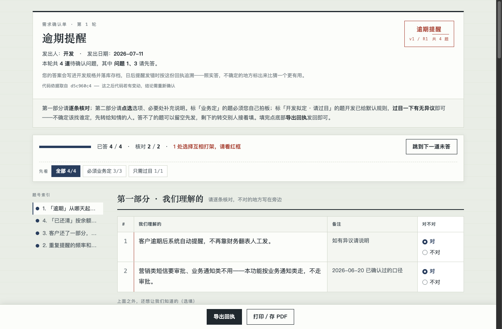
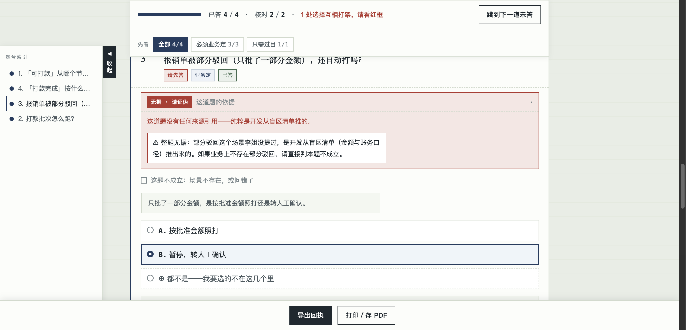

# Requirement Clarifier

**Turn ambiguous requirements into verified, traceable engineering specifications.**

A requirement engineering workflow for AI coding agents — Claude Code, OpenCode, Codex, Cursor, and any agent that speaks the `SKILL.md` convention. Its job is to stop your agent (and you) from writing code while the requirement is still fuzzy.

[](https://github.com/kj648/requirement-clarifier/actions/workflows/ci.yml)
[](https://github.com/kj648/requirement-clarifier/releases)
[](LICENSE)

**[中文文档 →](README.zh-CN.md)** · The generated artifacts follow the language you talk to the agent in — it writes the questions straight into `questionnaire.json`. For the confirmation sheet's own chrome (headings, buttons, receipt skeleton) set `"lang": "en"` in the sheet's `doc` block; `zh` is the default. Machine-readable keys and the three provenance tags stay in Chinese by design — they are protocol, read by the checker and the agent, never by the business.

---

## The problem

You paste a vague requirement — a voice memo from the business side, chat fragments, a PRD that only describes the happy path — and your coding agent **starts writing code immediately**. Every unstated rule becomes a silent guess baked into the implementation. Weeks later: "that's not what I said."

## What this skill does instead

```text
Raw requirement (chat / voice / vague PRD / legacy Excel)
      ↓
Input classification        — what's fact, what's the dev's own assumption
      ↓
Blind-spot analysis         — 12-dimension checklist: permissions, states,
      ↓                       concurrency, migration, money semantics, …
Interactive questionnaire   — single-file HTML the business fills by clicking;
      ↓                       every question carries its evidence
Answer acceptance           — grade answer quality, detect conflicts with
      ↓                       earlier decisions, split out smuggled new asks
Traceable specification     — every decision tagged 【Confirmed】/【Dev-default】/
      ↓                       【Assumption】 with an archived receipt behind it
Evidence verification + CI  — citations are machine-checked against sources
```

The person who *answers* the questions never needs to understand markdown, git, or AI. They get a single HTML file that works offline, in a corporate intranet, or inside WeChat — and exports a machine-checkable receipt.

## Ten-second version

**In** — one voice memo from the ops side:

> "Once a reimbursement claim is approved, just have the system pay it out automatically — stop making finance do the bank transfers by hand."

**Out** — the skill finds what nobody said, before any code exists:

```text
4 questions the business must settle first:
  Q1  When does a claim become "payable" — on approval, or after finance review?   [blocking]
  Q3  A claim gets PARTIALLY approved. Pay the approved amount, or hold for a human?
      ⚠ unsupported — this scenario was never mentioned; one click to falsify it
  Q2×Q3 contradiction caught while filling: "daily auto-batch" collides with
      "partially-approved claims wait for a human" — who pays that claim?

Resulting spec: 3 ×【Confirmed】 · 3 ×【Dev-default】 · 4 ×【Assumption】
every one traceable to an archived receipt
```

## What it looks like

The generated confirmation sheet — ledger-paper look, progress gate, per-item verification of "what we understood":



Every question carries its **evidence tier**. A question with no source is flagged red as *unsupported — please falsify*, gets a one-click "this scenario doesn't exist" exit, and live worked-number rows light up as the business clicks options:



## Tested, not just prompted

Most agent skills are "the author felt this prompt works". This one ships with its own harness:

- ✅ **189 regression tests** (Python stdlib `unittest`, zero third-party deps)
- ✅ **Evidence verification** — every `> 证据: path:line | "quote"` citation is checked against the actual source file; broken citations fail the build
- ✅ **Questionnaire contract validation** — dangling dependencies, asymmetric branches, advice-wording on policy questions, blocking questions without worked numbers: all rejected before the sheet ships
- ✅ **Receipt machine-check** — seven rules: unanswered blocking questions, unresolved contradictions, unchecked "what we understood" lines, questions the business disproved, "I don't know" without a named person, multi-select slips, leftover internal notes — all caught before answers get merged
- ✅ **Template JS syntax + contract probe** — the interactive sheet's script is extracted and checked in CI, because a syntax error means the business sees a blank page
- ✅ **7-step CI gate** on every push

## Install

**Fastest** (works for Claude Code, OpenCode, Codex, Cursor, and 12+ other harnesses via the [skills](https://www.npmjs.com/package/skills) installer):

```bash
npx skills add kj648/requirement-clarifier
```

Add `-g` to install globally instead of per-project.

**Manual clone:**

```bash
git clone https://github.com/kj648/requirement-clarifier.git \
  ~/.claude/skills/requirement-clarifier          # Claude Code
# or ~/.config/opencode/skills/…                  # OpenCode
# or ./.agents/skills/…                           # universal
```

**Or** grab `requirement-clarifier.skill` from [Releases](https://github.com/kj648/requirement-clarifier/releases) and import it.

## Quick start

Paste a messy requirement into your agent and say:

> "业务方说想加一个审批功能，让我理一下需求。"
> *("The business side wants an approval feature — help me clarify this requirement.")*

The skill takes over: archives the raw material, runs the blind-spot checklist, and hands you a fillable HTML questionnaire to take back to whoever owns the answers. When the receipt comes back, it grades the answers, catches contradictions, and writes the spec.

## Modes

**The core loop is one mode — Clarify.** Vague requirement in, blind-spot questions out, business confirms, traceable spec lands. Start there.

| Core | Trigger | Output |
|---|---|---|
| **Clarify** | "help me sort out this requirement" | question list + HTML questionnaire + spec |

Everything else is an advanced mode you grow into:

| Advanced | Trigger | Output |
|---|---|---|
| **Change** | "the business changed their mind about X" | impact analysis + rework-cost confirmation |
| **Context** | "note that '单子' means purchase order" | updated business-context file |
| **Reverse-engineer** | "migrate this legacy Excel / old system" | rule doc with owner sign-off slots + regression against history |
| **Chain audit** | "audit this module for hidden traps" | state × operation matrix + undefined-rule questions |

## How it differs from grill-me-style skills

Interview-your-plan skills (grill-me, brainstorming, …) interrogate **you, the developer** — recommended answers speed you up, and wrong guesses are yours to own. This skill produces artifacts for a **third party who didn't write the prompt**:

- **Never recommends an answer on policy/accounting questions** — a pre-checked default on "when does a claim become payable?" is the developer deciding on the business's behalf, with their signature on it
- **Every question carries its evidence** (verbatim quote / code citation / openly marked "unsupported"), and unsupported questions get a falsification exit instead of forcing a choice among wrong options
- **Every worked example is computed per branch** — the business compares 70.0% vs 63.6% vs 50.0%, not abstractions
- **The receipt is a provenance record**: timestamped, machine-checked, archived

## A complete worked example

[`examples/demo-project`](examples/) is a runnable miniature: one WeChat voice memo → blind-spot questions → a messy receipt (smuggled new requirement, a "whatever you think" answer downgraded to 【Dev-default】) → a spec that passes evidence verification. Both harness scripts run against it directly.

## Documentation

- [SKILL.md](SKILL.md) — the skill itself (five iron rules, modes, evidence discipline)
- [Questioning rules](references/questioning-rules.md) — read before generating a questionnaire
- [Design doc](docs/superpowers/specs/2026-08-27-html-questionnaire-design.md) — 23 recorded decisions incl. rejected alternatives, and an honest known-gaps table
- [中文完整文档](README.zh-CN.md)

## License

[MIT](LICENSE) — use it anywhere, commercial workflows included.
